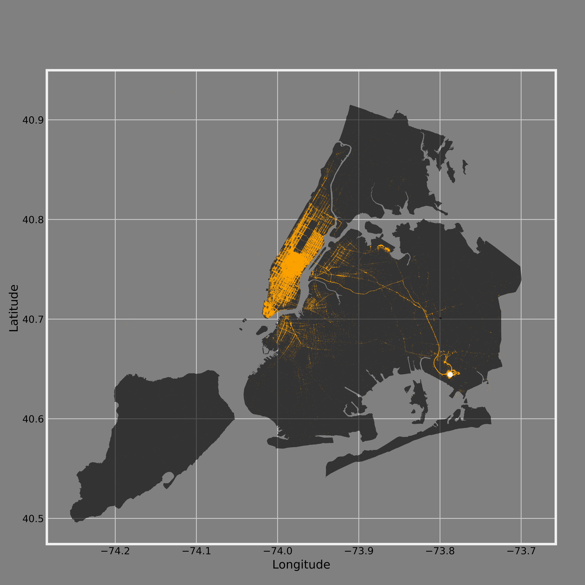

##### Figure 1. NYC yellow taxi trips to JFK airport in 2015. Points marked in yellow are the pickup locations. The bigger point marked in white is the location of JFK airport. Most of trips started from Manhattan.

## Review:

#### CLARITY: 
* The New York base map and latitude&longitude grids act as perfect tools to help us locate the yellow taxi pick up points. The figure title tells us that the directions of the trips are TOWARDS JFK airport. 
* Although the plot is not spatially ambiguous, it would be helpful to add legends in the plot showing what yellow points and large white point represent. By doing so the reader can quickly understand the plot without the aid of figure title. 
* In addition, a minor zoom-in plot of midtown manhattan might be needed if the reader requires better understanding of the spatial pattern of pickup points in this high density area at a higher spatial resolution.

#### AETHETIC: 
* Excellent choice of colors. Yellow is very intuitive and make it easy for people to associate the points with yellow taxis. The dark grey of New York base map forms a sharp contrast to the bright color of pick up points and airport, significanlty enhancing the readability of this plot. 
* The concise style of the plot makes convey of information very efficient and no distraction is presented. 
* No exaggerated waste of space in the plot, although the blank area in the top left corner can be used to host the legends or the minor plot proposed in CLARITY section. 

#### HONESTY: 
* The plot honestly demonstrates the spatial distribution of all pick up locations throughout 2015 and no deformation or distortion are done to emphasize a certain feature. 